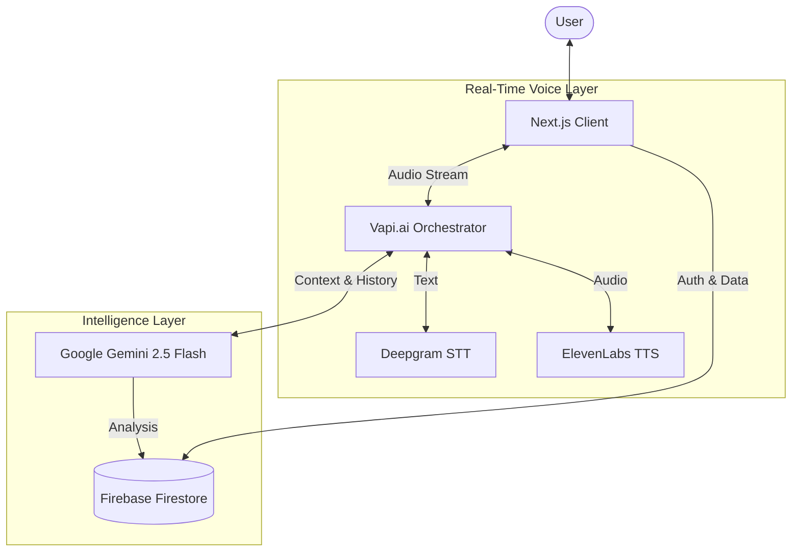

# 🎯 Prepzo — Your Personal AI Interview Coach

> **"Like a real interview, but personalised for you."**  
> **Master your technical interviews through realistic, voice-based simulations and intelligent feedback.**

**Prepzo** is not just another question bank. It’s an interactive AI interview platform that treats interview preparation like an actual conversation. Whether you need a general mock interview or a targeted session on a specific tech stack, Prepzo adapts to your needs.

---

## 🌟 Why Prepzo?

Traditional interview prep like mock quizes fails to capture the pressure and dynamic nature of a real interview.

**Prepzo fills this gap by simulating the entire lifecycle:**

1.  **Requirement Gathering:** Just like a recruiter or an initial screen, we figure out _exactly_ what you need.
2.  **The Interview:** A real-time voice conversation where you speak, and the AI listens, questions, and follows up.
3.  **The Feedback:** Detailed, constructive criticism to help you improve.

---

## ✨ Key Features

### 🗣️ 1. Pre-Interview Consultation (The "Receptionist")

Before the interview starts, you sit down for a quick voice session with our "Receptionist" agent.

- **Dynamic Requirement Gathering:** Instead of filling out boring forms or parsing a static resume, you simply _tell_ the agent what you want.
  - _"I want to practice for a Senior Frontend role focusing on React and performance."_
  - _"Grill me on system design concepts for a backend role."_
- **Personalised Experience:** The agent understands your specific goals—whether you're a fresher looking for a general checkup or a senior dev needing to polish specific skills—and tailors the upcoming interview session accordingly.

### 🎙️ 2. The Main Interview (Real-Time Voice)

Once the stage is set, the main interview begins.

- **Powered by ElevenLabs & Vapi:** A high-quality, ultra-low latency voice interaction that feels natural.
- **Adaptive Questioning:** Questions are not pulled randomly from a list. They are generated by **Google Gemini**, specifically curated based on your consultation session.
- **Interactive Flow:** The AI listens to your answers, asks follow-up questions, and digs deeper if your answers are vague—just like a real interviewer.

### 📊 3. Intelligent Feedback Loop

The interview doesn't end when you hang up.

- **Comprehensive Analysis:** The entire transcript is analyzed by **Google Gemini** to evaluate your performance.
- **Structured Scoring:** Get a breakdown of your Technical Skills, Communication, Problem Solving, and Confidence.
- **Actionable Advice:** Receive specific tips on how to improve your answers and clarity.
- **Retake & Improve:** Use the feedback to sharpen your skills and jump back in for another round.

---

## 🧩 Architecture Overview

Prepzo relies on a sophisticated orchestration of AI models and real-time data streams.



### Core Components Flow

1.  **The Client**: Your browser handles the UI and establishes a secure WebSocket connection to Vapi.
2.  **Voice Layer**: Vapi acts as the conductor. It sends your speech to **Deepgram** for instant transcription and routes the text to **Gemini**.
3.  **The Brain (Gemini)**:
    - In **Consultation Mode**, it acts as a listener, extracting your requirements to build a JSON profile.
    - In **Interview Mode**, it acts as the interviewer, generating relevant questions and improvising based on your answers.
4.  **The Response**: Gemini's text response is sent to **ElevenLabs**, which converts it into high-quality human speech and streams it back to you—all in milliseconds.
5.  **Feedback**: Once the session ends, Gemini analyzes the full transcript stored in **Firestore** to generate your performance report.

---

## 🛠️ Tech Stack

Prepzo is built with a modern, scalable stack designed for real-time AI performance.

### **Core Framework**

- **Next.js 16 (App Router)** - The React framework for the web.
- **React 19** - For a responsive and modern UI.
- **TypeScript** - For type-safe code.

### **AI & Voice Orchestration**

- **Vapi AI** - Handles the complex orchestration of voice data streams.
- **ElevenLabs** - Provides industry-leading, human-like voice synthesis for the interviewer.
- **Deepgram** - Ultra-fast Speech-to-Text (STT) transcription.
- **Google Gemini 2.5 Flash** - The brain behind the operation. Used for:
  - Generating dynamic interview questions based on user intent.
  - Analyzing transcripts for detailed feedback.

### **Backend & Database**

- **Firebase Firestore** - Real-time database for storing user profiles, interview transcripts, and feedback.
- **Firebase Authentication** - Secure user management.

### **UI & Styling**

- **Tailwind CSS** - For rapid, beautiful styling.
- **Radix UI / Shadcn** - Accessible, unstyled components.
- **Lucide React** - Beautiful vector icons.

---

## 📖 How It Works

1.  **Connect:** Sign in and launch the **"Consultation"** session.
2.  **Speak:** Tell the Receptionist agent what you want to practice (e.g., "React Native", "Java System Design").
3.  **Prepare:** The system generates a custom interview profile for you.
4.  **Interview:** Enter the **Main Session**. Answer questions, explain your thought process, and interact naturally.
5.  **Review:** Receive your **Feedback Report**. Read the analysis, check your scores, and see where you can improve.

---

## 🚀 Getting Started

### Prerequisites

- Node.js 18+
- Vapi Account (Public Key)
- Google Gemini API Key
- Firebase Project

### Installation

```bash
git clone <repository-url>
cd prepzo
npm install
```

### Environment Variables

Create a `.env.local` file:

```env
# Firebase Client
NEXT_PUBLIC_FIREBASE_API_KEY=...
NEXT_PUBLIC_FIREBASE_PROJECT_ID=...
# ... other firebase config

# Vapi AI
NEXT_PUBLIC_VAPI_WEB_TOKEN=...
NEXT_PUBLIC_VAPI_WORKFLOW_ID=...

# Google Gemini
GOOGLE_GENERATIVE_AI_API_KEY=...
```

### Run Locally

```bash
npm run dev
```

Open [http://localhost:3000](http://localhost:3000) to start your interview journey!

---

<div align="center">
  <p>Built with ❤️ by a developer who knows the pain of interviews.</p>
</div>
